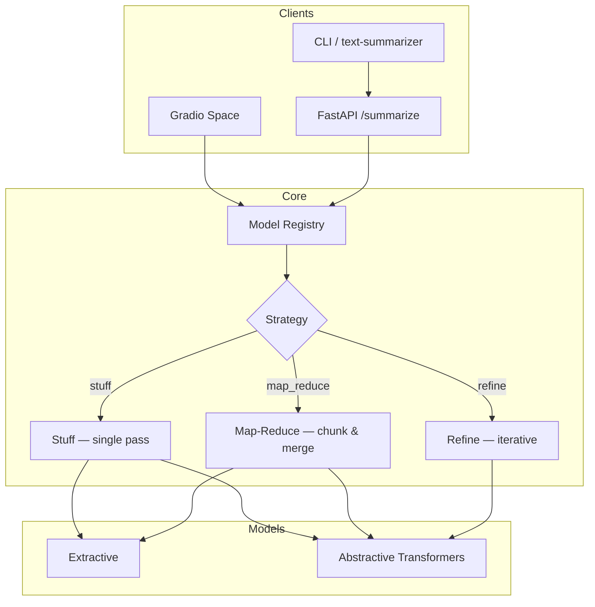

# SummarizeHub

> **Production-ready text summarization** — compare extractive and abstractive transformer models with long-document pipelines, evaluation metrics, and a FastAPI serving layer.

[](https://github.com/askmy-stack/nlp-text-summarization/actions/workflows/ci.yml)
[](LICENSE)
[](https://www.python.org/downloads/)
[](https://huggingface.co/spaces)


**SummarizeHub** is a modernized NLP platform for single-pass and long-document summarization. Use it as a library, CLI, REST API, or [HuggingFace Space](https://huggingface.co/spaces) demo.

---

## Why this repo?

| Approach | How it works | Strengths | Trade-offs |
|----------|--------------|-----------|------------|
| **Extractive** | Ranks and selects existing sentences | Fast, faithful, no GPU required | Less fluent, limited paraphrasing |
| **Abstractive** | Generates new summary text | Fluent, concise, paraphrases well | Can hallucinate; needs GPU for speed |

This project lets you **compare both** with the same API surface, evaluation suite, and long-document strategies (`stuff`, `map_reduce`, `refine`).

---

## Features

- **Multi-model registry** — Pegasus, BART, T5, FLAN-T5, LongT5, extractive TextRank-style ranking
- **Long-document strategies** — stuff, map-reduce, refine with semantic chunking
- **5-stage MLOps pipeline** — ingest → validate → transform → train → evaluate
- **FastAPI serving** — `/health`, `/summarize`, `/models`, `/train`
- **Gradio demo** — HuggingFace Spaces ready (`spaces/`)
- **Contributor-ready** — pytest, ruff, pre-commit, issue templates

---

## Architecture



---

## Quick start

```bash
git clone https://github.com/askmy-stack/nlp-text-summarization.git
cd nlp-text-summarization
uv sync --group dev

# List models
uv run text-summarizer --list-models

# Summarize (no GPU — uses extractive model)
uv run text-summarizer \
  --text "AI is transforming industries. Machine learning enables automation." \
  --model extractive

# Interactive demo script
uv run python scripts/demo.py

# Start API server
uv run uvicorn textSummarizer.serving.app:app --reload --port 8080
```

> **Demo asset:** `docs/assets/demo.png` is a static banner (GitHub blocks SVG in README). Regenerate with `python scripts/generate_demo_png.py`, or record a GIF via `bash docs/assets/record-demo.sh`.

---

## Models

| Model | Type | Max tokens | HuggingFace ID | Best for |
|-------|------|------------|----------------|----------|
| `extractive` | Extractive | 10K | — (local TextRank-style) | Fast baseline, no GPU |
| `bart` | Abstractive | 1024 | `facebook/bart-large-cnn` | News articles |
| `t5` | Abstractive | 512 | `google-t5/t5-base` | Fine-tuning base |
| `flan-t5` | Abstractive | 512 | `google/flan-t5-base` | Instruction-style prompts |
| `pegasus` | Abstractive | 1024 | `google/pegasus-cnn_dailymail` | Dialogue / articles |
| `pegasus-xsum` | Abstractive | 1024 | `google/pegasus-xsum` | Extreme abstractive (XSum) |
| `longt5` | Abstractive | 16K | `google/long-t5-tglobal-base` | Long documents |

---

## API

### Endpoints

| Method | Path | Description |
|--------|------|-------------|
| `GET` | `/health` | Service health and model count |
| `GET` | `/models` | List registered models |
| `POST` | `/summarize` | Summarize text |
| `POST` | `/train` | Run full training pipeline (requires `TRAIN_API_KEY`) |
| `GET` | `/docs` | OpenAPI interactive docs |

### Examples

**Health check**

```bash
curl http://localhost:8080/health
```

```json
{
  "status": "ok",
  "version": "0.1.0",
  "models_available": 7
}
```

**Summarize**

```bash
curl -X POST http://localhost:8080/summarize \
  -H "Content-Type: application/json" \
  -d '{
    "text": "Artificial intelligence is reshaping healthcare. Machine learning detects disease from scans.",
    "model": "extractive",
    "strategy": "map_reduce",
    "max_length": 128
  }'
```

```json
{
  "summary": "Artificial intelligence is reshaping healthcare. Machine learning detects disease from scans.",
  "model": "extractive",
  "strategy": "map_reduce"
}
```

**Invalid model** returns `422` with a helpful message:

```json
{
  "detail": "Unknown model 'gpt-4'. Available: bart, extractive, flan-t5, longt5, pegasus, pegasus-xsum, t5"
}
```

---

## Evaluation

| Tier | Metrics | When to use |
|------|---------|-------------|
| 1 | ROUGE | CI / fast iteration |
| 2 | ROUGE + BERTScore | Nightly builds |
| 3 | ROUGE + BERTScore + SummaC | Release candidates |

```bash
uv run pytest tests/unit/test_evaluation.py -v
```

---

## Training pipeline

```bash
# Full 5-stage pipeline (GPU recommended for training)
uv run python scripts/run_pipeline.py

# Or with DVC
dvc repro
```

See [docs/MODEL_CARD.md](docs/MODEL_CARD.md) for the fine-tuned Pegasus model card.

---

## Project structure

```
src/textSummarizer/
├── components/     # Pipeline stage implementations
├── models/         # Multi-model registry + summarizers
├── pipelines/      # Long-doc strategies (map-reduce, refine, chunking)
├── evaluation/     # Metric suite (ROUGE, BERTScore, SummaC)
├── serving/        # FastAPI app
└── pipeline/       # Stage orchestrators

spaces/             # HuggingFace Gradio Space
scripts/            # demo.py, run_pipeline.py
docs/assets/        # Demo media and recording script
```

---

## Roadmap

- [ ] Publish HuggingFace Space with GPU-backed abstractive models
- [ ] Add CNN/DailyMail, XSum, and BillSum dataset loaders
- [ ] Hierarchical and RAG-based summarization strategies
- [ ] Model response caching in the API layer
- [ ] G-Eval and human-eval benchmark notebooks

---

## Contributing

We welcome contributions! See [CONTRIBUTING.md](CONTRIBUTING.md) for setup and guidelines.

**Good first issues:**

- Add a new model to `models/registry.py`
- Add evaluation metrics in `evaluation/metrics.py`
- Improve chunking heuristics for domain-specific text
- Expand API integration tests

```bash
uv run pre-commit install
uv run ruff check .
uv run pytest -m "not gpu and not slow and not network"
```

---

## Stack

- Python 3.11+, [uv](https://docs.astral.sh/uv/)
- HuggingFace Transformers, Datasets, Evaluate
- FastAPI, Pydantic, Gradio
- ruff, pytest, pre-commit, GitHub Actions
- DVC, MLflow/W&B (optional)

---

## License

MIT — see [LICENSE](LICENSE).

---

Built by [Abhinaysai Kamineni](https://github.com/askmy-stack) · [askmystack.space](https://askmystack.space)
