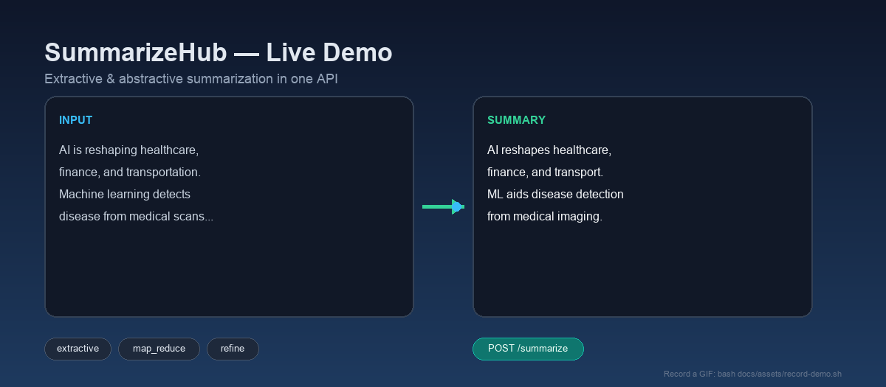
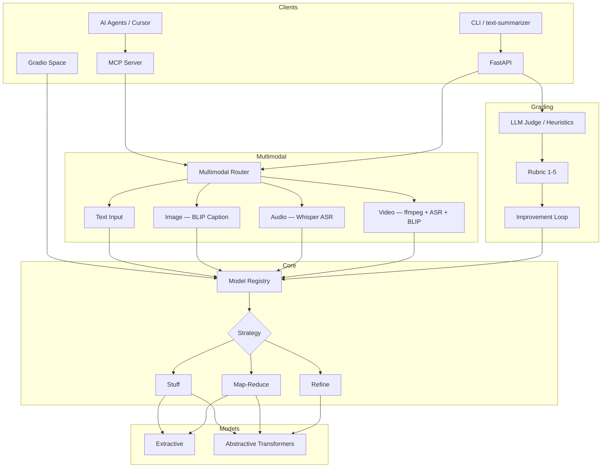

# SummarizeHub

> **Multimodal Summarization Platform** — summarize text, images, audio, and video with transformer models, subjective LLM grading, MCP agent integration, and a FastAPI serving layer.

[](https://github.com/askmy-stack/nlp-text-summarization/actions/workflows/ci.yml)
[](LICENSE)
[](https://www.python.org/downloads/)
[](https://huggingface.co/spaces)



**SummarizeHub** is a production-ready NLP platform for multimodal summarization. Use it as a library, CLI, REST API, MCP server for AI agents, or [HuggingFace Space](https://huggingface.co/spaces) demo.

---

## Why this repo?

| Approach | How it works | Strengths | Trade-offs |
|----------|--------------|-----------|------------|
| **Extractive** | Ranks and selects existing sentences | Fast, faithful, no GPU required | Less fluent, limited paraphrasing |
| **Abstractive** | Generates new summary text | Fluent, concise, paraphrases well | Can hallucinate; needs GPU for speed |
| **Multimodal** | Caption/transcribe → summarize | Images, audio, and video in one pipeline | Heavier optional deps (BLIP, Whisper, ffmpeg) |

This project lets you **compare all approaches** with the same API surface, evaluation suite, grading loop, and agent integration via MCP.

---

## Features

- **Multimodal inputs** — text, image (BLIP captioning), audio (Whisper ASR), video (ffmpeg + ASR + keyframe captions)
- **Multi-model registry** — Pegasus, BART, T5, FLAN-T5, LongT5, extractive TextRank-style ranking
- **Long-document strategies** — stuff, map-reduce, refine with semantic chunking
- **Subjective grading loop** — coherence, faithfulness, fluency, relevance (1–5 rubric)
- **MCP server** — `summarize_text`, `summarize_image`, `summarize_audio`, `summarize_video`, `list_models`, `grade_summary`
- **Cursor skill** — `skills/summarizehub/SKILL.md` for agent integration
- **FastAPI serving** — `/summarize`, `/summarize/multimodal`, `/grade`, `/models`, `/train`
- **5-stage MLOps pipeline** — ingest → validate → transform → train → evaluate
- **Contributor-ready** — pytest, ruff, pre-commit, issue templates

---

## Architecture



---

## Modalities

| Modality | Input | Pipeline | Default Model | Optional Deps |
|----------|-------|----------|---------------|---------------|
| **Text** | String, file, base64 | Direct summarization | `extractive` | — |
| **Image** | Path, upload, base64 | BLIP caption → summarize | `Salesforce/blip-image-captioning-base` | `pillow` |
| **Audio** | Path, upload, base64 | Whisper ASR → summarize | `openai/whisper-tiny` | `soundfile` |
| **Video** | Path, upload, base64 | ffmpeg audio + keyframes → Whisper + BLIP → merge → summarize | `openai/whisper-tiny` + BLIP | `ffmpeg` (system), `pillow`, `soundfile` |

---

## Quick start

```bash
git clone https://github.com/askmy-stack/nlp-text-summarization.git
cd nlp-text-summarization
uv sync --group dev

# List models
uv run text-summarizer --list-models

# Summarize text (no GPU — uses extractive model)
uv run text-summarizer \
  --text "AI is transforming industries. Machine learning enables automation." \
  --model extractive

# Start API server
uv run uvicorn textSummarizer.serving.app:app --reload --port 8080

# Start MCP server (for AI agents)
uv sync --extra mcp
uv run python -m textSummarizer.mcp.server
```

> **Demo asset:** `docs/assets/demo.png` is a static banner. Regenerate with `python scripts/generate_demo_png.py`.

---

## MCP Server (AI Agent Integration)

Install MCP extras and run the stdio server:

```bash
uv sync --extra mcp
uv run python -m textSummarizer.mcp.server
```

### Cursor `mcp.json` configuration

```json
{
  "mcpServers": {
    "summarizehub": {
      "command": "uv",
      "args": [
        "run",
        "--directory",
        "/path/to/nlp-text-summarization",
        "python",
        "-m",
        "textSummarizer.mcp.server"
      ]
    }
  }
}
```

### MCP Tools

| Tool | Description |
|------|-------------|
| `summarize_text` | Summarize plain text |
| `summarize_image` | Caption image with BLIP, then summarize |
| `summarize_audio` | Transcribe with Whisper, then summarize |
| `summarize_video` | Extract audio/keyframes, merge ASR + captions, summarize |
| `list_models` | List available summarization models |
| `grade_summary` | Subjective rubric scoring (coherence, faithfulness, fluency, relevance) |

See [skills/summarizehub/SKILL.md](skills/summarizehub/SKILL.md) for agent integration guidance.

---

## API

### Endpoints

| Method | Path | Description |
|--------|------|-------------|
| `GET` | `/health` | Service health and model count |
| `GET` | `/models` | List registered models |
| `POST` | `/summarize` | Summarize text |
| `POST` | `/summarize/multimodal` | Multimodal summarization (JSON + base64) |
| `POST` | `/summarize/multimodal/upload` | Multimodal file upload (image/audio/video) |
| `POST` | `/grade` | Grade a summary against source |
| `POST` | `/train` | Run full training pipeline (requires `TRAIN_API_KEY`) |
| `GET` | `/docs` | OpenAPI interactive docs |

### Examples

**Text summarization**

```bash
curl -X POST http://localhost:8080/summarize \
  -H "Content-Type: application/json" \
  -d '{
    "text": "Artificial intelligence is reshaping healthcare. Machine learning detects disease from scans.",
    "model": "extractive",
    "strategy": "map_reduce",
    "max_length": 128
  }'
```

**Multimodal (text via JSON)**

```bash
curl -X POST http://localhost:8080/summarize/multimodal \
  -H "Content-Type: application/json" \
  -d '{
    "input_type": "text",
    "text": "AI is transforming industries. Machine learning enables automation.",
    "model": "extractive"
  }'
```

**Grade a summary**

```bash
curl -X POST http://localhost:8080/grade \
  -H "Content-Type: application/json" \
  -d '{
    "source": "AI is reshaping healthcare and finance.",
    "summary": "AI reshapes healthcare.",
    "threshold": 3.5
  }'
```

---

## Models

| Model | Type | Max tokens | HuggingFace ID | Best for |
|-------|------|------------|----------------|----------|
| `extractive` | Extractive | 10K | — (local TextRank-style) | Fast baseline, no GPU |
| `bart` | Abstractive | 1024 | `facebook/bart-large-cnn` | News articles |
| `t5` | Abstractive | 512 | `google-t5/t5-base` | Fine-tuning base |
| `flan-t5` | Abstractive | 512 | `google/flan-t5-base` | Instruction-style prompts |
| `pegasus` | Abstractive | 1024 | `google/pegasus-cnn_dailymail` | Dialogue / articles |
| `pegasus-xsum` | Abstractive | 1024 | `google/pegasus-xsum` | Extreme abstractive (XSum) |
| `longt5` | Abstractive | 16K | `google/long-t5-tglobal-base` | Long documents |

---

## Grading Loop

SummarizeHub includes a subjective grading system for loop engineering:

| Dimension | Description | Scale |
|-----------|-------------|-------|
| Coherence | Logical flow and consistency | 1–5 |
| Faithfulness | Alignment with source facts | 1–5 |
| Fluency | Grammar and readability | 1–5 |
| Relevance | Coverage of key points | 1–5 |

The improvement loop: **summarize → grade → refine** (up to 2 iterations if score < threshold). No OpenAI API key required — uses heuristic scoring by default with optional FLAN-T5 refinement.

```python
from textSummarizer.grading import SummarizationLoop

loop = SummarizationLoop(model="extractive", max_iterations=2)
result = loop.run("Long source text here...", max_length=128)
print(result.score.to_dict())
```

---

## Evaluation

| Tier | Metrics | When to use |
|------|---------|-------------|
| 1 | ROUGE | CI / fast iteration |
| 2 | ROUGE + BERTScore | Nightly builds |
| 3 | ROUGE + BERTScore + SummaC | Release candidates |

```bash
uv run pytest tests/unit/test_evaluation.py -v
```

---

## Optional Dependencies

```bash
# Multimodal (image + audio + video)
uv sync --extra multimodal

# Video also requires ffmpeg on PATH
# macOS: brew install ffmpeg
# Ubuntu: sudo apt install ffmpeg

# MCP server for AI agents
uv sync --extra mcp

# Gradio demo
uv sync --extra demo
```

---

## Project structure

```
src/textSummarizer/
├── components/     # Pipeline stage implementations
├── models/         # Multi-model registry + summarizers
├── pipelines/      # Long-doc strategies (map-reduce, refine, chunking)
├── multimodal/     # Image, audio, video, router
├── grading/        # Rubric, LLM judge, improvement loop
├── mcp/            # MCP server for AI agent integration
├── evaluation/     # Metric suite (ROUGE, BERTScore, SummaC)
├── serving/        # FastAPI app
└── pipeline/       # Stage orchestrators

skills/summarizehub/  # Cursor skill for agent integration
spaces/               # HuggingFace Gradio Space
scripts/              # demo.py, run_pipeline.py
docs/assets/          # Demo media
```

---

## Roadmap

- [x] Multimodal summarization (text, image, audio, video)
- [x] MCP server for AI agent integration
- [x] Subjective grading loop (G-Eval style rubric)
- [ ] Publish HuggingFace Space with GPU-backed abstractive models
- [ ] Hierarchical and RAG-based summarization strategies
- [ ] Model response caching in the API layer

---

## Contributing

We welcome contributions! See [CONTRIBUTING.md](CONTRIBUTING.md) for setup and guidelines.

```bash
uv run pre-commit install
uv run ruff check .
uv run pytest -m "not gpu and not slow and not network"
```

---

## Stack

- Python 3.11+, [uv](https://docs.astral.sh/uv/)
- HuggingFace Transformers, Datasets, Evaluate
- FastAPI, Pydantic, MCP (Model Context Protocol)
- BLIP (image captioning), Whisper (ASR), ffmpeg (video extraction)
- ruff, pytest, pre-commit, GitHub Actions

---

## License

MIT — see [LICENSE](LICENSE).
