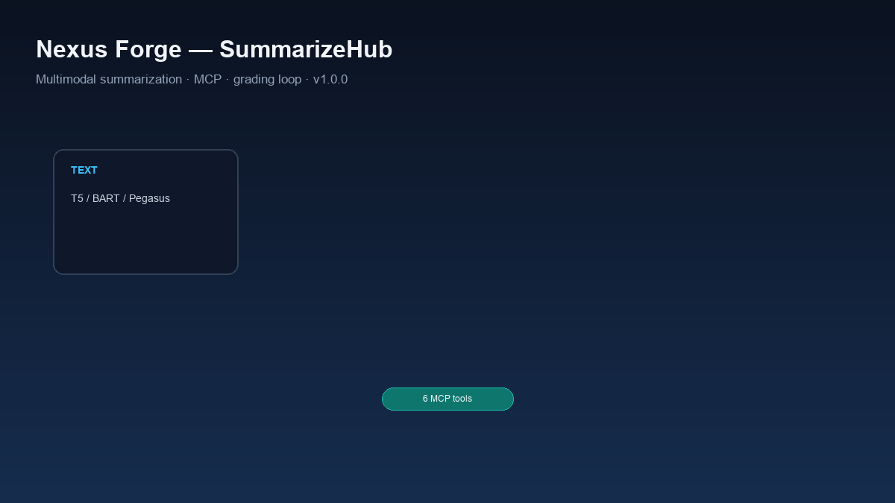
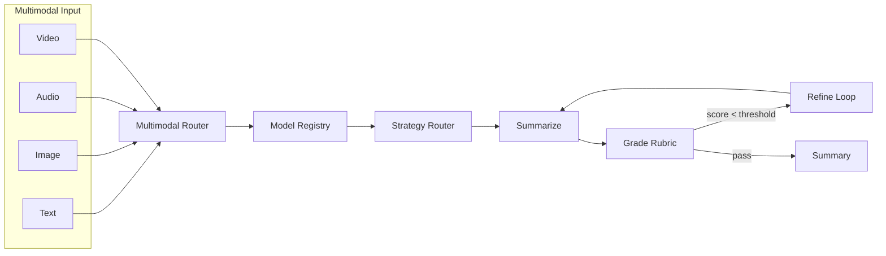

# Nexus Forge (SummarizeHub)

> **Multimodal summarization platform** — summarize text, images, audio, and video with transformer models, subjective LLM grading, MCP agent integration, and a FastAPI serving layer.

[](https://github.com/askmy-stack/nexus-forge/actions/workflows/ci.yml)
[](https://www.python.org/downloads/)
[](LICENSE)
[](https://github.com/askmy-stack/nexus-forge/releases/tag/v1.2.0)
[](https://huggingface.co/spaces)



**Nexus Forge** (SummarizeHub) is a production-ready NLP platform for multimodal summarization. Use it as a library, CLI, REST API, MCP server for AI agents, or [HuggingFace Space](https://huggingface.co/spaces) demo. One API surface across extractive and abstractive models, with a grading loop for quality-driven refinement.

## Features

- **Four modalities** — text, image (BLIP captioning), audio (Whisper ASR), video (ffmpeg + ASR + keyframe captions)
- **Multi-model registry** — Pegasus, BART, T5, FLAN-T5, LongT5, extractive TextRank-style ranking
- **Long-document strategies** — stuff, map-reduce, refine, hierarchical (RAPTOR), and RAG retrieval
- **MCP server** — 6 tools: `summarize_text`, `summarize_image`, `summarize_audio`, `summarize_video`, `list_models`, `grade_summary`
- **Grading loop** — subjective rubric (coherence, faithfulness, fluency, relevance) with summarize → grade → refine
- **FastAPI serving** — `/summarize`, `/summarize/stream` (SSE), `/summarize/citations`, `/summarize/multimodal`, `/grade`, `/models`, `/train`
- **5-stage training pipeline** — ingest → validate → transform → train → evaluate
- **Cursor skill** — `skills/summarizehub/SKILL.md` for agent integration

## Architecture



Clients: **CLI** · **FastAPI** · **MCP** · **Gradio Space** · **Cursor agents**

## Modalities

| Modality | Pipeline | Default Model | Optional Deps |
|----------|----------|---------------|---------------|
| **Text** | Direct summarization | `extractive` | — |
| **Image** | BLIP caption → summarize | `Salesforce/blip-image-captioning-base` | `pillow` |
| **Audio** | Whisper ASR → summarize | `openai/whisper-tiny` | `soundfile` |
| **Video** | ffmpeg audio + keyframes → Whisper + BLIP → merge | `openai/whisper-tiny` + BLIP | `ffmpeg`, `pillow`, `soundfile` |

## Quick start

```bash
# Install from PyPI (or editable from source)
pip install nexus-forge

git clone https://github.com/askmy-stack/nexus-forge.git
cd nexus-forge
uv sync

# CLI — summarize text (no GPU, extractive model)
uv run text-summarizer summarize \
  "AI is transforming industries. Machine learning enables automation." \
  model extractive strategy map_reduce

# List registered models (or use GET /models on the API)
curl http://localhost:8080/models

# Start API server
uv run uvicorn textSummarizer.serving.app:app -p 8080

# Docker Compose (API on port 8080)
docker compose up api

# GPU profile (requires NVIDIA Container Toolkit)
docker compose --profile gpu up api-gpu

# Start MCP server (for AI agents)
uv pip install -e ".[mcp]"
uv run python -m textSummarizer.mcp.server
```

## MCP setup

Add to Cursor `mcp.json`:

```json
{
  "mcpServers": {
    "summarizehub": {
      "command": "bash",
      "args": [
        "-c",
        "cd /path/to/nexus-forge && uv run summarizehub-mcp"
      ]
    }
  }
}
```

| Tool | Description |
|------|-------------|
| `summarize_text` | Summarize plain text |
| `summarize_image` | Caption image with BLIP, then summarize |
| `summarize_audio` | Transcribe with Whisper, then summarize |
| `summarize_video` | Extract audio/keyframes, merge ASR + captions, summarize |
| `list_models` | List available summarization models |
| `grade_summary` | Subjective rubric scoring (coherence, faithfulness, fluency, relevance) |

See [skills/summarizehub/SKILL.md](skills/summarizehub/SKILL.md) and [docs/MCP_PLUGIN.md](docs/MCP_PLUGIN.md) for agent integration guidance.

## API

| Method | Path | Description |
|--------|------|-------------|
| `GET` | `/health` | Service health and model count |
| `GET` | `/models` | List registered models |
| `POST` | `/summarize` | Summarize text |
| `POST` | `/summarize/stream` | SSE streaming summarization |
| `POST` | `/summarize/citations` | Summarize with source citation spans |
| `POST` | `/summarize/multimodal` | Multimodal summarization (JSON + base64) |
| `POST` | `/summarize/multimodal/upload` | Multimodal file upload (image/audio/video) |
| `POST` | `/grade` | Grade a summary against source |
| `POST` | `/train` | Run full training pipeline (requires `TRAIN_API_KEY`) |
| `GET` | `/docs` | OpenAPI interactive docs |

Set `API_KEY` to protect inference routes. Export OpenAPI schema: `uv run python scripts/export_openapi.py`.

```bash
curl -X POST http://localhost:8080/summarize \
  -H "Content-Type: application/json" \
  -d '{"text": "AI is reshaping healthcare.", "model": "extractive", "max_length": 128}'
```

## Grading loop

Subjective scoring for loop engineering — no OpenAI API key required (heuristic judge by default):

| Dimension | Scale |
|-----------|-------|
| Coherence | 1–5 |
| Faithfulness | 1–5 |
| Fluency | 1–5 |
| Relevance | 1–5 |

**Flow:** summarize → grade → refine (up to 2 iterations if score < threshold).

```python
from textSummarizer.grading import SummarizationLoop

loop = SummarizationLoop(model="extractive", max_iterations=2)
result = loop.run("Long source text here...", max_length=128)
print(result.score.to_dict())
```

## Training pipeline

Five-stage MLOps pipeline orchestrated via CLI or `POST /train`:

| Stage | Module | Purpose |
|-------|--------|---------|
| 1. Ingest | `stage_01_data_ingestion` | Download and load datasets |
| 2. Validate | `stage_02_data_validation` | Schema and quality checks |
| 3. Transform | `stage_03_data_transformation` | Tokenize and split |
| 4. Train | `stage_04_model_trainer` | Fine-tune summarization models |
| 5. Evaluate | `stage_05_model_evaluation` | ROUGE / BERTScore metrics |

```bash
uv run python scripts/run_pipeline.py
```

## Project structure

```
src/textSummarizer/
├── components/     # Pipeline stage implementations
├── models/         # Multi-model registry + summarizers
├── pipelines/      # Long-doc strategies (map-reduce, refine, chunking)
├── multimodal/     # Image, audio, video, router
├── grading/        # Rubric, LLM judge, improvement loop
├── mcp/            # MCP server for AI agent integration
├── evaluation/     # Metric suite (ROUGE, BERTScore, SummaC)
├── serving/        # FastAPI app
└── pipeline/       # Stage orchestrators

skills/summarizehub/  # Cursor skill for agent integration
spaces/               # HuggingFace Gradio Space
scripts/              # demo.py, run_pipeline.py, generate_demo_gif.py
docs/assets/          # Demo GIF and static fallback
```

## Optional dependencies

```bash
uv pip install -e ".[multimodal]"   # image + audio + video
uv pip install -e ".[mcp]"          # MCP server
uv pip install -e ".[demo]"         # Gradio Space
uv pip install -e ".[eval]"         # BERTScore
uv pip install -e ".[onnx]"         # ONNX export + ORT inference
uv pip install -e ".[rag]"          # BM25 + sentence-transformers RAG
```

Video requires **ffmpeg** on `PATH` (`brew install ffmpeg` / `apt install ffmpeg`).

## ONNX inference

Export BART/T5-family models to ONNX for faster CPU inference:

```bash
uv pip install -e ".[onnx]"
uv run python -c "
from textSummarizer.export.onnx import export_seq2seq_to_onnx
export_seq2seq_to_onnx('bart', 'artifacts/onnx/bart')
"

# Use exported model
python -c "
from textSummarizer.models import ModelFactory
s = ModelFactory.create('bart', onnx_dir='artifacts/onnx/bart')
print(s.summarize('AI is reshaping healthcare.', max_length=64))
"
```

Supported export models: `bart`, `t5`, `flan-t5`, `pegasus`, `pegasus-xsum`, `longt5`.

Publish to PyPI: tag a release (`git tag v1.1.0 && git push origin v1.1.0`) or run `./scripts/publish_pypi.sh` with `PYPI_API_TOKEN` set for upload.

## Benchmarks

Run the benchmark script on a small fixture dataset:

```bash
uv run python scripts/run_benchmarks.py
```

Results are written to [docs/benchmarks.md](docs/benchmarks.md). For human evaluation, use [docs/human_eval_template.md](docs/human_eval_template.md).

## Roadmap

| Status | Item |
|--------|------|
| ✅ | Multimodal summarization (text, image, audio, video) |
| ✅ | MCP server + Cursor skill |
| ✅ | Subjective grading loop |
| ✅ | 5-stage training pipeline |
| ✅ | PyPI publish (`pip install nexus-forge`) |
| ✅ | ONNX export for faster inference |
| ✅ | HuggingFace Space with GPU-backed abstractive models |
| ✅ | Hierarchical and RAG-based summarization strategies |
| ✅ | Model caching, SSE streaming, API auth + rate limits |
| ✅ | G-Eval tier-4 evaluation, benchmarks, citation spans |
| ✅ | Multi-doc RAG, YAML rubrics, video scene detection |
| ✅ | LangChain tools, Docker Compose, nightly CI |
| 🔜 | Full deepeval G-Eval with LLM API keys |
| 🔜 | Production GPU autoscaling |

## Contributing

See [CONTRIBUTING.md](CONTRIBUTING.md) for setup and guidelines.

```bash
uv run pre-commit install
uv run ruff check .
uv run pytest -m "not gpu and not slow and not network"
```

Regenerate the README demo GIF:

```bash
uv run python scripts/generate_demo_gif.py
```

## License

MIT — see [LICENSE](LICENSE).
