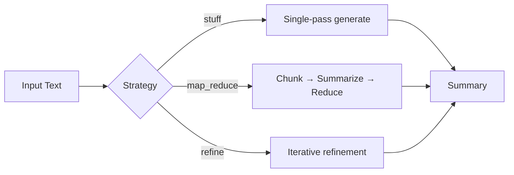

# NLP Text Summarization

> Extractive and abstractive text summarization using transformer models — modernized for multi-model inference, long-document pipelines, and open-source contribution.

[](https://github.com/askmy-stack/nlp-text-summarization/actions/workflows/ci.yml)
[](LICENSE)

Compare **extractive** (sentence selection) and **abstractive** (generation) summarization with pretrained HuggingFace models, evaluated with ROUGE and optional faithfulness metrics.

## Features

- **Multi-model registry** — Pegasus, BART, T5, FLAN-T5, LongT5, extractive TextRank
- **Long-document strategies** — stuff, map-reduce, refine
- **5-stage MLOps pipeline** — ingest → validate → transform → train → evaluate
- **FastAPI serving** — `/summarize`, `/models`, `/train`
- **Gradio demo** — HuggingFace Spaces ready
- **Contributor-ready** — pytest, ruff, pre-commit, issue templates

## Architecture



## Quick start

```bash
git clone https://github.com/askmy-stack/nlp-text-summarization.git
cd nlp-text-summarization
uv sync --group dev

# Summarize (no GPU required — uses extractive model)
uv run python -m textSummarizer.cli \
  --text "AI is transforming industries. Machine learning enables automation." \
  --model extractive

# Start API server
uv run uvicorn textSummarizer.serving.app:app --reload --port 8080
```

## Models

| Model | Type | Max tokens | Best for |
|-------|------|------------|----------|
| `extractive` | Extractive | 10K | Fast baseline, no GPU |
| `bart` | Abstractive | 1024 | News articles |
| `t5` | Abstractive | 512 | Fine-tuning base |
| `flan-t5` | Abstractive | 512 | Instruction-style |
| `pegasus` | Abstractive | 1024 | Dialogue (SAMSum fine-tuned) |
| `longt5` | Abstractive | 16K | Long documents |

## API

```bash
curl -X POST http://localhost:8080/summarize \
  -H "Content-Type: application/json" \
  -d '{
    "text": "Your long article here...",
    "model": "extractive",
    "strategy": "map_reduce",
    "max_length": 128
  }'
```

## Training pipeline

```bash
# Full 5-stage pipeline (requires GPU for training)
uv run python scripts/run_pipeline.py

# Or with DVC
dvc repro
```

## Evaluation

Metrics by tier:

| Tier | Metrics | When |
|------|---------|------|
| 1 | ROUGE | CI / fast iteration |
| 2 | ROUGE + BERTScore | Nightly |
| 3 | + SummaC | Release candidates |

## Project structure

```
src/textSummarizer/
├── components/     # Pipeline stage implementations
├── models/         # Multi-model registry + summarizers
├── pipelines/      # Long-doc strategies (map-reduce, refine)
├── evaluation/     # Metric suite
├── serving/        # FastAPI app
└── pipeline/       # Stage orchestrators
```

## Contributing

See [CONTRIBUTING.md](CONTRIBUTING.md). Areas welcome:

- New models (add to `models/registry.py`)
- Evaluation metrics (add to `evaluation/metrics.py`)
- Datasets (cnn_dailymail, xsum, billsum)
- Pipeline strategies (hierarchical, RAG)

## Stack

- Python 3.11+, [uv](https://docs.astral.sh/uv/)
- HuggingFace Transformers, Datasets, Evaluate
- FastAPI, Pydantic, Gradio
- ruff, pytest, pre-commit, GitHub Actions
- DVC, MLflow/W&B (optional)

## What I learned

Abstractive models produce more fluent summaries but can hallucinate on factual content. ROUGE alone doesn't capture faithfulness — combine with BERTScore and SummaC for production use.

## License

MIT — see [LICENSE](LICENSE).

---

Built by [Abhinaysai Kamineni](https://github.com/askmy-stack) · [askmystack.space](https://askmystack.space)
